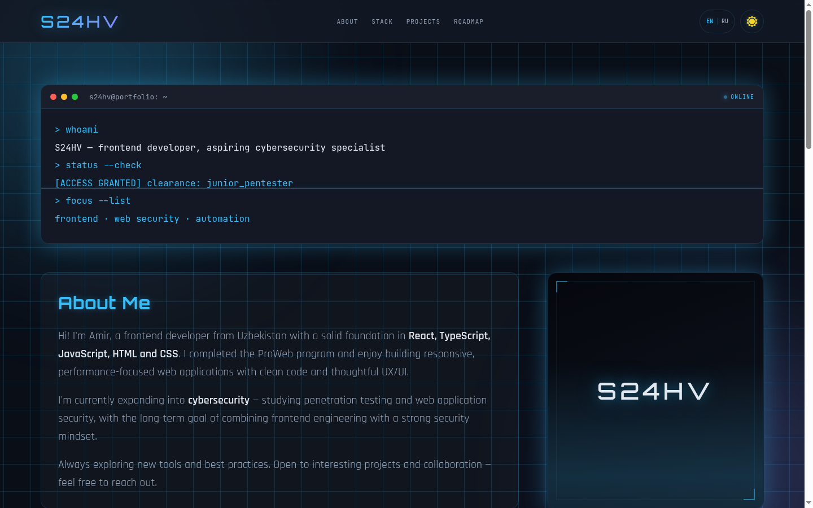
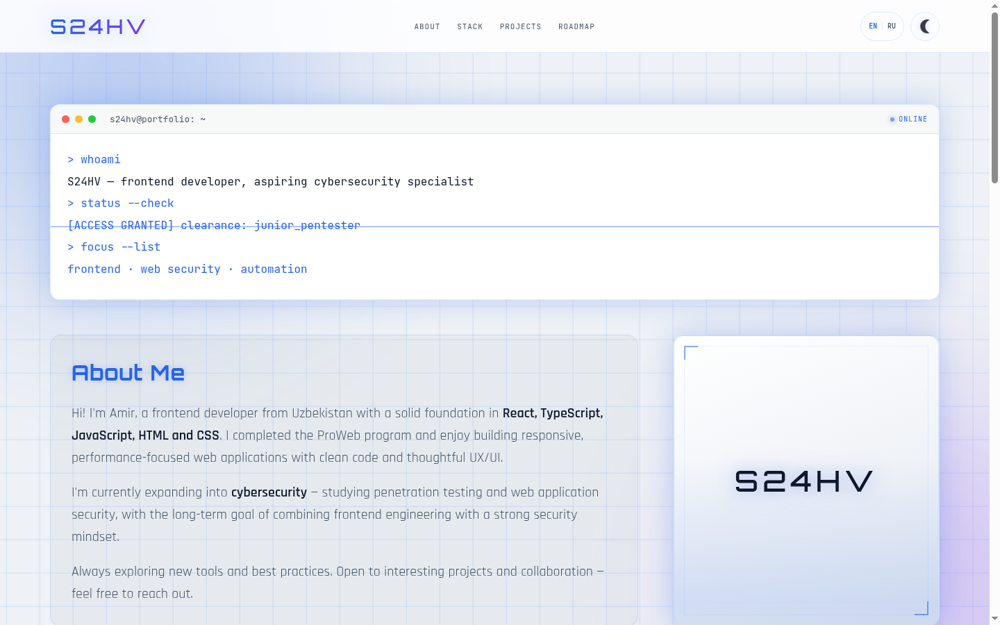
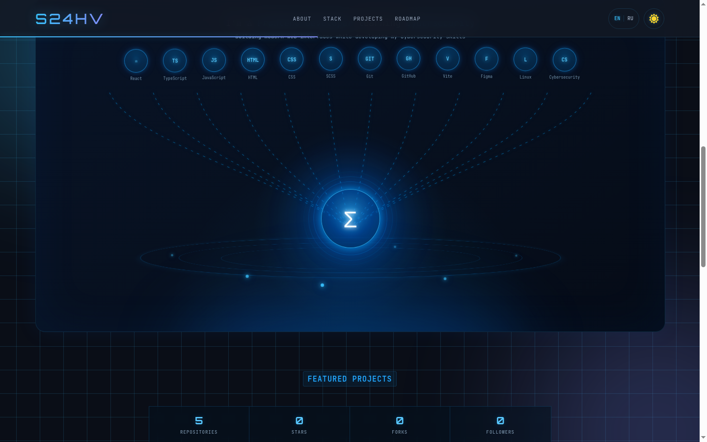
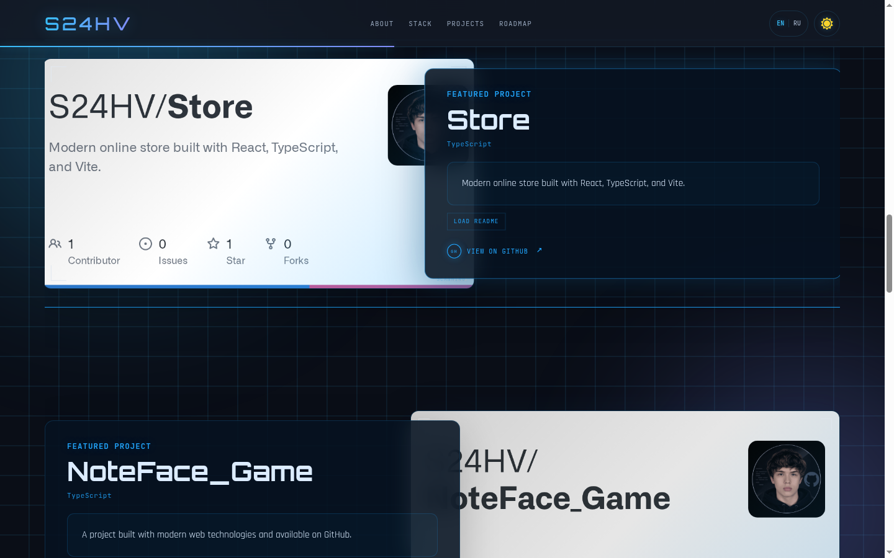
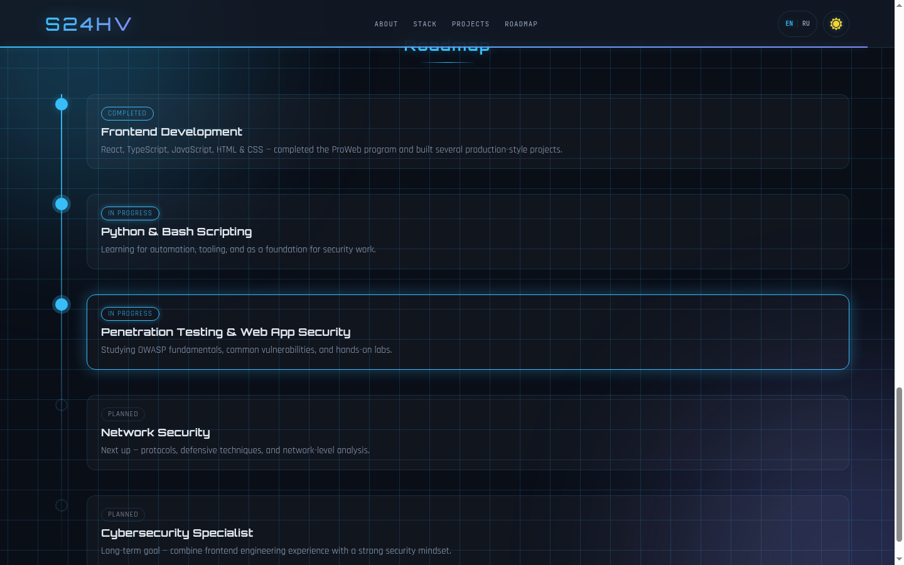

<div align="center">

# `S24HV` — Personal Portfolio

**Cyber-terminal styled developer portfolio that builds itself from the GitHub API.**

[](https://react.dev)
[](https://www.typescriptlang.org)
[](https://vite.dev)
[](https://redux-toolkit.js.org)
[](https://sass-lang.com)

### [→ Live demo](https://s24hv.github.io/Portfolio/)



</div>

---

## About

Single-page portfolio of **Amir Sukhov** — frontend developer from Uzbekistan, moving into web application security.
The page opens with a boot sequence, greets you with an interactive terminal, and pulls repositories,
languages and READMEs straight from the GitHub API, so the content stays up to date without redeploys.

## Features

| | |
|---|---|
| **Boot sequence** | Animated terminal boot screen on first load |
| **Terminal hero** | `whoami` / `status --check` / `focus --list` typed out live |
| **Dark / light theme** | Redux Toolkit slice, saved in `localStorage` |
| **EN / RU** | Full interface translation, language remembered between visits |
| **Tech stack orbit** | Animated core with skills orbiting around it |
| **Projects from GitHub** | Repositories, per-language filters, stars/forks/issues counters |
| **Inline README viewer** | `LOAD README` renders any repo's README with `react-markdown` |
| **Roadmap** | Learning timeline: frontend → scripting → pentesting → security |

## Screenshots

| Dark theme | Light theme |
|---|---|
|  |  |

| Tech stack | Projects |
|---|---|
|  |  |



## Tech stack

| Layer | Tools |
|---|---|
| UI | React 18.3, TypeScript 5.6 |
| Build | Vite 6 |
| State | Redux Toolkit 2.5, React Redux 9 |
| Styling | Sass / SCSS modules, custom CSS variables |
| Data | axios → GitHub REST API |
| Markdown | react-markdown + remark-gfm |
| Deploy | gh-pages → GitHub Pages |

## Quick start

```bash
git clone https://github.com/S24HV/Portfolio.git
cd Portfolio
npm install
npm run dev
```

Open http://localhost:5173/Portfolio/

### Scripts

| Command | Description |
|---|---|
| `npm run dev` | Dev server with HMR |
| `npm run build` | Type-check and build into `dist/` |
| `npm run preview` | Serve the production build locally |
| `npm run lint` | ESLint over the whole project |
| `npm run deploy` | Build and publish `dist/` to the `gh-pages` branch |

## Project structure

```text
src/
├── components/      Header, BootScreen, Hero, About, TechStack, Projects, Roadmap, BottomBar
├── services/        github.ts (GitHub API + cache), language.ts (i18n)
├── store/           Redux Toolkit store and theme slice
├── assets/
├── global.styles.scss
└── App.tsx
docs/screenshots/    Images used in this README
```

## Deployment

```bash
npm run deploy
```

Builds the project and pushes `dist/` to the `gh-pages` branch; GitHub Pages serves it at
[s24hv.github.io/Portfolio](https://s24hv.github.io/Portfolio/).
The base path is set in `vite.config.ts` (`base: "/Portfolio"`) — keep it in sync with the repository name.

## Contact

[](mailto:amirsuhov@gmail.com)
[](https://t.me/S_24_HV)
[](https://github.com/S24HV)
